# Guide to generating and comparing 3D protein structures 

This tutorial provides a step by step guide for generating 3D structural predictions using the AlphaFold3 web interface and performing structural comparisons using the Foldseek and DALI web server.

## Prerequisites

No coding knowledge is required. The only setup needed is to create an account on the AlphaFold3 web server: [https://alphafoldserver.com/welcome](https://alphafoldserver.com/welcome).  

Note that this web interface is not ideal for analyses requiring large batches of 3D predictions (as you are limited to 30 jobs per day) or custom templates, and it enforces fixed parameters. For more advanced and customizable workflows, consider using the open-source version of AlphaFold3: [https://github.com/google-deepmind/alphafold3](https://github.com/google-deepmind/alphafold3) though this does require a computational background.

AlphaFold3 already provides a detailed guide, so please read the official documentation here: [AlphaFold3 Guide](https://alphafoldserver.com/guides) before starting to fully understand the web interface.


## Getting Started

For this tutorial, I will demonstrate the output using two sequences. By following this workflow, you will confidently be able to report what they are.


**Sequence 1:**

```
Ga0531454_000088_17320_15773_17
MQTKNGLVPTLRLSFEMTDALASIEQEGLKINLDTLEEIERSYQQEMDDLEVRLKELAQDAVGDTPVNLASPDDRSMLLYSRRVTNKQEWAAIFNLGTERRGATVKPKMRRRMSRKEFNRNVGRLTEVVYKTRAERCTNCLGHGRTRVVKKDGTLGKATRVCRVCGGSGVVYHNTHEVAGFKLLPRTTYDLAAAGFRTDKDTLDERRDDLRGDGREFVESYVRYNALRTYLNTFVEGIKNNVDSKGFIHPEFMQCVTATGRLSSRNPNFQNMPRGSTFAIRKVVESRFSGGYILEGDYSQLEFRVAGFLAKDEQAYTDVKNSVDVHNYTASVIGCTRQEAKAHTFKPLYGGTSGTEDQKRYYAAFKDKYAGVTEWHEELQRQAVTKRVIALPSGREYAFPDARWTEYGTATNRTAICNYPVQGFATADLLPIALVSLHNVVKSAGIRSVICNTVHDSIVMDVHPDEKDTCIDLMKHAMLSLPFETMRRYGLAYDMPVGIELKMGKNWLDLHEVEL
```

**Sequence 2:**
```
Ga0531454_000088_18790_18007_20
YRVVTNDLDALIDEEVGDPDFPFEFELIREHLPGLDRGNLGILFARPEVGKTTFCSFLAASYVRQGFRVSYWANEEPAEKIMLRIAQSYFAVFTSEMRGPMREDFVRRYAEEIAPYLTIMDSVGTSIEELDDYAKLNKPDIIFADQLDKFRIGGEYNRGDERLKQTYVLAREIAKRNKCLVWAVSQASYEAHDRQFIDYSMLDNSRTGKAGEADIIIGIGKTGSSEVENTVRHICISKNKLNGYHGMINSQIDVRRGVYY
```

## 3D structruture predictions using Alphafold3

### Submission

Once logged in to Alphafold3, you should be directed to the default submission page.

Paste the **Sequence 1** residues into the input field and select **Protein**, as we are working with amino acid sequences. Set **Copies** to 1 since we are only interested in monomer predictions for this tutorial.

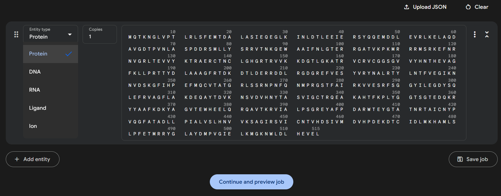

### Run Job

You can optionally set a **Job Name** to help organize your submissions.  

If you want reproducible results, set a **Seed** value. The seed controls the random initialization of the model -- using the same seed with the same input will always return the same prediction. If left blank, the server will assign a random seed, which may yield slightly different outputs across runs.

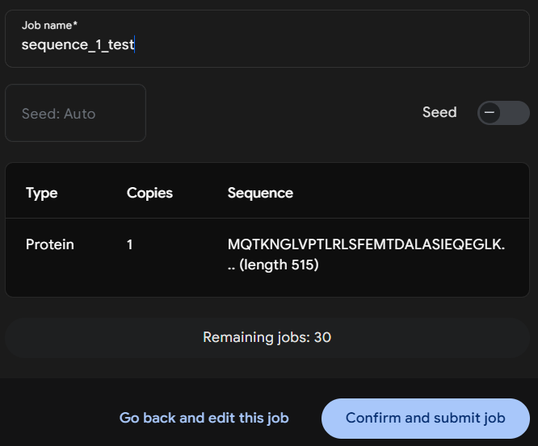

Click **Confirm and submit job**. The prediction process typically takes 5 to 10 minutes to complete but is largely dependent on the size of the protein.

Below the sequence submission form is the **Job History** section. Once your job is finished, a checkmark will appear to the left of the job name. Click on the job name to view the 3D structure prediction.

### Results

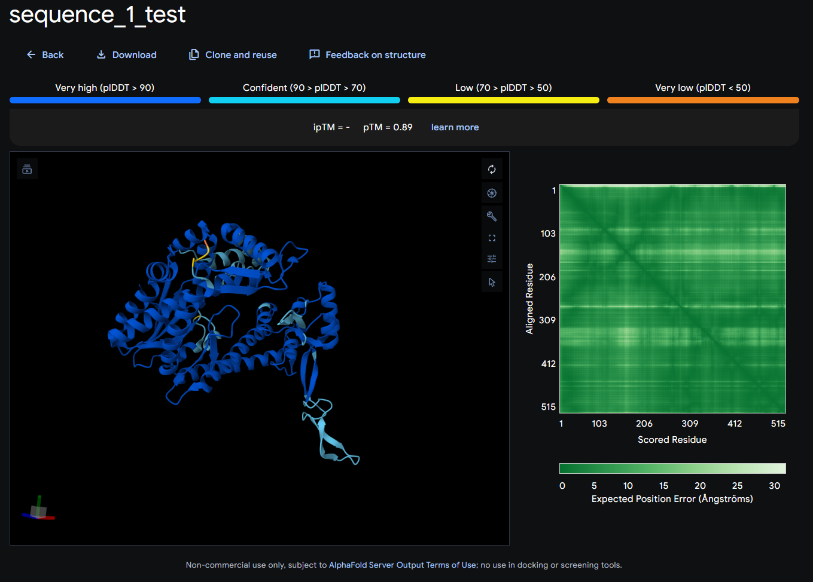

All results are displayed on this page. For more detailed explanations of each output, refer back to the guide mentioned at the beginning.

The most important score here is the **pTM** (Predicted TM-score). Generally, a score above 0.5 suggests a predicted fold that may resemble one of the templates in the PDB. If you are seeing a lot of red and orange with a low **pTM** you may not want to use this structure. 

The **ipTM** (interface predicted TM-score) is currently blank because we are not modeling protein-protein interactions in this tutorial.

### Download

Click the **Download** button at the top of the results page and unzip the directory to access the Crystallographic Information Files (.cif), which contain the atomic structure data.

AlphaFold3 returns five sets of predictions, labeled model_0 through model_4, along with their corresponding confidence scores in the summary_confidences_0-4 files. In practice, model_0 often contains the best prediction, but it is a good idea to review all confidence scores to confirm.

### Follow up

Repeat this process for sequence two. Once you have both model_0.cif for **Sequence 1** and two you can move to the next step. 

## Structural Comparison with Foldseek

Foldseek is a fast and scalable tool for comparing protein 3D structures by aligning them using structural similarity, enabling high throughput searches across large structure databases.

### Submission

After unzipping your AlphaFold3 output and selecting the best model (e.g., fold_sequence_1_test_model_0.cif), head over to the [Foldseek Search Server](https://search.foldseek.com/search) to compare your predicted structure against a wide range of structural databases.

Using the web interface limits some customization compared to running Foldseek locally, but again no coding experience is needed. For a deeper understanding of the Foldseek methods and advanced usage options, it is highly recommended to read through the official documentation:

[Foldseek GitHub Repository](https://github.com/steineggerlab/foldseek)

[Foldseek Wiki](https://github.com/steineggerlab/foldseek/wiki)

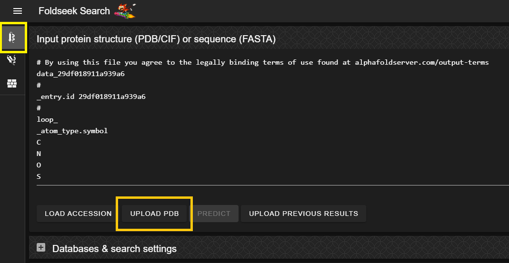

Once on the Foldseek homepage, navigate to the **Monomer Search** tab (this should be the default view) and upload your *protein.cif* file of interest.

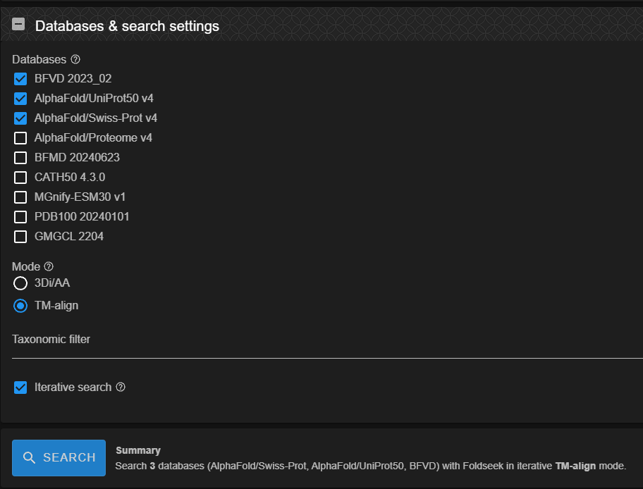

#### Databases

The image above shows the available subject databases and run options you can select. For phage (known and unknown), I typically stick with the parameters shown in the figure. I usually only select the databases highlighted there, but you can experiment with others depending on your research questions. Keep in mind that the more databases you select, the longer the job will take to run.

#### Mode

I recommend selecting **TM-align** as the search mode. For more information on the differences between available modes, consult the [Foldseek GitHub documentation](https://github.com/steineggerlab/foldseek).

#### Sensitivity

Iterative searching is generally not needed if you are already identifying homologous hits to known sequences. It can increase runtime significantly but may help uncover distant homologs in more unknown sequences.

### Results

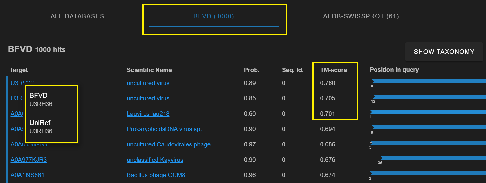

Once your job is complete, the **Results** page will display a list of 1000 top hits for each database you selected, as well as an aggregated view under the **ALL DATABASES** tab, sorted by best scores.

For this example, we will focus on the top hits in the **BFVD** database. Results are sorted by **TM-align score**, so you can choose the top ranking structure as the best representative. To explore more details, click on the **Target URL** to view the full entry on its dedicated results page. Depending on what you select, this will either redirect you to Foldseek **BFVD** or a Uniref results page. 

### Download

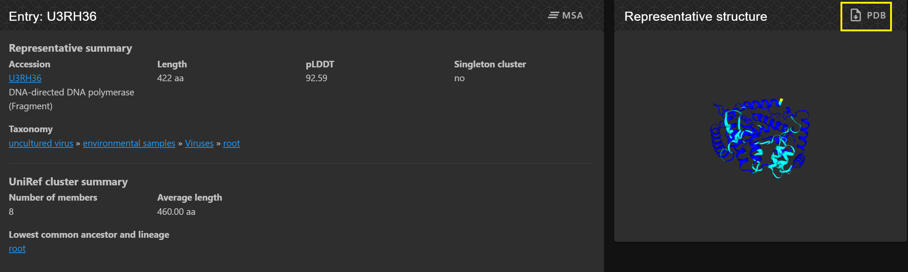

The top hit page is fairly self explanatory. In this example, we can see that our **Sequence 1** test is similar to a DNA polymerase.

To download the top hit representative structure, click the **PDB** button located above the structure viewer.

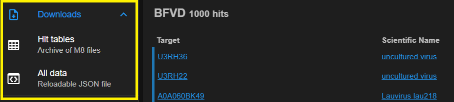

To download the full top hit results table, navigate back to the **Results** page and use the dropdown menu to the left of the hit list and select the desired format for download.

### Follow up

You now know how to generate a protein structure using AlphaFold3, perform a structural comparison with TM-align via Foldseek, identify top hits across multiple databases, explore annotations, and download a representative structure.

However, if you are searching for unknowns and still receive low scores or no informative representatives, a different approach will be needed to further investigate the structure or function.

## Structural Comparison with DALI

DALI (Distance matrix ALIgnment) compares protein structures based on intramolecular distance patterns to detect structural similarities, even among distantly related proteins.

### Submission

If you are still interested in exploring your sequence of interest and did not find informative hits using Foldseek, you can try the [DALI webserver](http://ekhidna2.biocenter.helsinki.fi/dali/).

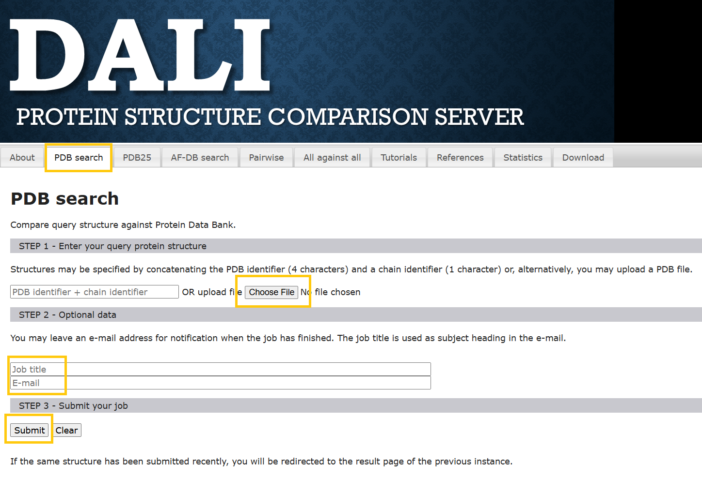

In this example, I search **Sequence 1** against the **Protein Data Bank (PDB)** using **PDB Search** by uploading a *.pdb* file and providing a **Job title** and **Email address** to receive the results.

**Important:**  
DALI does not accept *.cif* files, so you must convert your AlphaFold3 output to *.pdb* format before submitting. You can write your own script or use this online converter:  

[.cif -> to -> .pdb converter](https://project-gemmi.github.io/wasm/convert/cif2pdb.html)

### Results

You should receive an email with the results in about 5 to 10 minutes. Alternatively, the submission page may redirect you directly to the results once processing is complete if you have the tab open.

A detailed explanation of the DALI output can be found in the following guide:
 
[DALI Tutorial 2022 (PDF)](http://ekhidna2.biocenter.helsinki.fi/dali/DaliTutorial2022.pdf)

For that reason, I will not go into detail here about how to interpret the output.

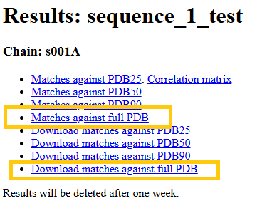

Whether through the page redirection or the email link, you will be taken to the DALI results page. From here, you can explore individual hits or download the full results table.

For this tutorial, we will focus on the **Matches against full PDB** section to get a comprehensive view of structural similarities.

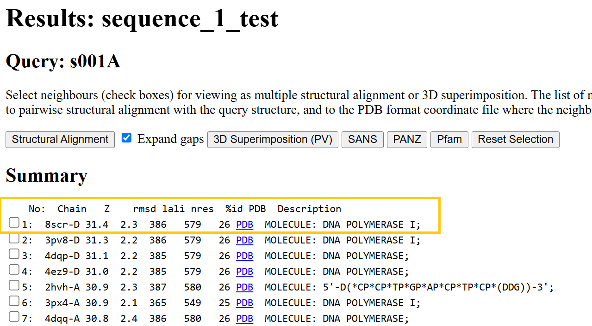

The DALI results table summarizes structural alignments between your query and known protein structures. Key columns include:

**Z**: Statistical significance of the alignment (higher = more confident match)

**RMSD**: Root-mean-square deviation between aligned structures

**%ID**: Percent sequence identity

**PDB**: Link to the matched PDB entry

**Description**: Functional annotation of the hit


In this example, the top hits all align to **DNA polymerase** proteins, suggesting strong structural similarity with the query sequence.

The top hit aligns with the **8src-D** chain, showing a high **Z-score (31.4)** and a moderately low **RMSD (2.3)**, which suggests similar function but some degree of structural divergence in the fold.

You can look up this complex on the **RCSB PDB** to view the full crystal structure along with other metadata:

[https://www.rcsb.org/structure/1KFD](https://www.rcsb.org/structure/1KFD)

### Follow up

This section provides a way to search for more remote homology by using **Z-score** and **RMSD** values to assess fold similarity. Even when sequence identity is low, high Z-scores with reasonable RMSD values can indicate structural conservation. This can help refine your hypothesis about protein function. Follow-up analyses, such as structural alignments, allow you to precisely identify which regions of your unknown structure align with known proteins, offering deeper insight into potential roles and evolutionary relationships.

## Practice: Sequence 2 Analysis

Try running this workflow with **Sequence 2** to see if you can generate a confident structural prediction. Based on the Foldseek or DALI results, assess whether any functional or structural annotations can be confidently assigned.

If you are curious whether **Sequence 2** may physically interact with **Sequence 1**, consider testing them together using **AlphaFold3 Multimer**, which is designed to predict protein-protein complexes.


## Authors

Contributors names and contact info

zschreib@udel.edu

## Acknowledgments

The tutorial here utilizes tools from various sources:

Abramson, J et al. *Accurate structure prediction of biomolecular interactions with AlphaFold 3.* Nature, 2024.

van Kempen M, Kim S, Tumescheit C, Mirdita M, Lee J, Gilchrist CLM, Soding J, and Steinegger M.  
*Fast and accurate protein structure search with Foldseek.* Nature Biotechnology, 2023.

Holm, Liisa. *Dali server: structural unification of protein families.* Nucleic acids research 50.W1, 2022.

Sebastian Bittrich, Joan Segura, Jose M Duarte, Stephen K Burley, Yana Rose, *RCSB protein Data Bank: exploring protein 3D similarities via comprehensive structural alignments.* Bioinformatics, Volume 40, Issue 6, June 2024.
