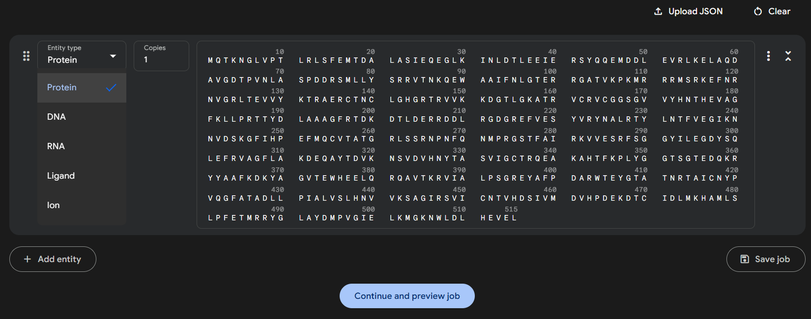
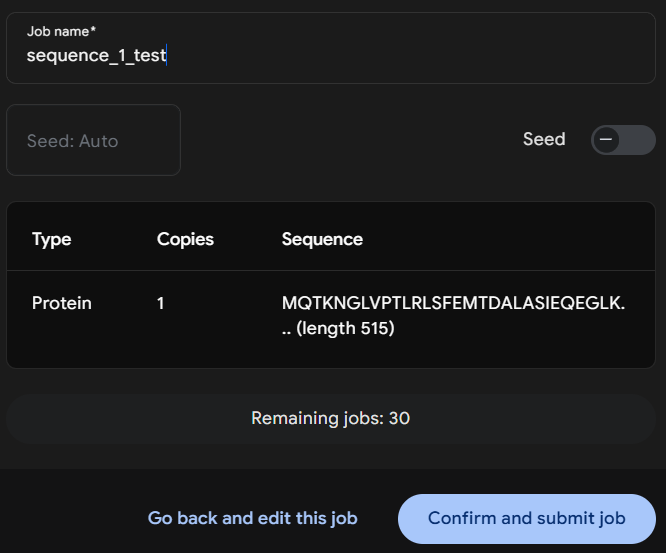

# Guide to generating and comparing 3D protein structures 

This tutorial provides a step-by-step guide for generating 3D structural predictions using AlphaFold3’s web interface, performing structural comparisons with Foldseek, and visualizing pairwise alignments via the RCSB PDB platform.

## Prerequisites

No coding knowledge is required. The only setup needed is to create an account on the AlphaFold3 web server: [https://alphafoldserver.com/welcome](https://alphafoldserver.com/welcome).  

Note that this web interface is not ideal for analyses requiring large batches of 3D predictions (as you are limited to 30 jobs per day) or custom templates, and it enforces fixed parameters. For more advanced and customizable workflows, consider using the open-source version of AlphaFold3: [https://github.com/google-deepmind/alphafold3](https://github.com/google-deepmind/alphafold3) — though this does require a computational background.

AlphaFold3 already provides a detailed guide, so please read the official documentation here: [AlphaFold3 Guide](https://alphafoldserver.com/guides) before starting to fully understand the web interface.


## Getting Started

For this tutorial, I will demonstrate the output using two sequences. By following this workflow, you will confidently be able to report what they are.


**Sequence 1:**

```
>Ga0531454_000088_17320_15773_17
MQTKNGLVPTLRLSFEMTDALASIEQEGLKINLDTLEEIERSYQQEMDDLEVRLKELAQDAVGDTPVNLASPDDRSMLLYSRRVTNKQEWAAIFNLGTERRGATVKPKMRRRMSRKEFNRNVGRLTEVVYKTRAERCTNCLGHGRTRVVKKDGTLGKATRVCRVCGGSGVVYHNTHEVAGFKLLPRTTYDLAAAGFRTDKDTLDERRDDLRGDGREFVESYVRYNALRTYLNTFVEGIKNNVDSKGFIHPEFMQCVTATGRLSSRNPNFQNMPRGSTFAIRKVVESRFSGGYILEGDYSQLEFRVAGFLAKDEQAYTDVKNSVDVHNYTASVIGCTRQEAKAHTFKPLYGGTSGTEDQKRYYAAFKDKYAGVTEWHEELQRQAVTKRVIALPSGREYAFPDARWTEYGTATNRTAICNYPVQGFATADLLPIALVSLHNVVKSAGIRSVICNTVHDSIVMDVHPDEKDTCIDLMKHAMLSLPFETMRRYGLAYDMPVGIELKMGKNWLDLHEVEL
```

**Sequence 2:**
```
>Ga0531454_000088_18790_18007_20
YRVVTNDLDALIDEEVGDPDFPFEFELIREHLPGLDRGNLGILFARPEVGKTTFCSFLAASYVRQGFRVSYWANEEPAEKIMLRIAQSYFAVFTSEMRGPMREDFVRRYAEEIAPYLTIMDSVGTSIEELDDYAKLNKPDIIFADQLDKFRIGGEYNRGDERLKQTYVLAREIAKRNKCLVWAVSQASYEAHDRQFIDYSMLDNSRTGKAGEADIIIGIGKTGSSEVENTVRHICISKNKLNGYHGMINSQIDVRRGVYY
```

## 3D structruture predictions

### Submission

Once logged in to Alphafold3, you should be directed to the default submission page.

Paste the **Sequence 1** residues into the input field and select **Protein**, as we are working with amino acid sequences. Set **Copies** to `1` since we are only interested in monomer predictions for this tutorial.



### Run Job

You can optionally set a **Job Name** to help organize your submissions.  

If you want reproducible results, set a **Seed** value. The seed controls the random initialization of the model — using the same seed with the same input will always return the same prediction. If left blank, the server will assign a random seed, which may yield slightly different outputs across runs.



Click **Confirm and submit job**. The prediction process typically takes 5 to 10 minutes to complete but is largely dependent on the size of the protein.

Below the sequence submission form is the **Job History** section. Once your job is finished, a checkmark will appear to the left of the job name. Click on the job name to view the 3D structure prediction.

### Results


All results are displayed on this page. For more detailed explanations of each output, refer back to the guide mentioned at the beginning.

The most important score here is the **pTM** (Predicted TM-score). Generally, a score above 0.5 suggests a predicted fold that may resemble one of the templates in the PDB. If you are seeing a lot of red and orange with a low **pTM** you may not want to use this structure. 

The **ipTM** (interface predicted TM-score) is currently blank because we are not modeling protein-protein interactions in this tutorial.

### Download

Click the **Download** button at the top of the results page and unzip the directory to access the Crystallographic Information Files (`.cif`), which contain the atomic structure data.

AlphaFold3 returns five sets of predictions, labeled model_0 through model_4, along with their corresponding confidence scores in the summary_confidences_0-4 files. In practice, model_0 often contains the best prediction, but it is a good idea to review all confidence scores to confirm.
